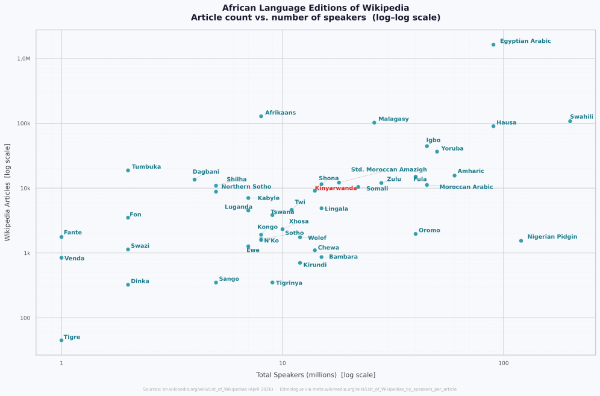
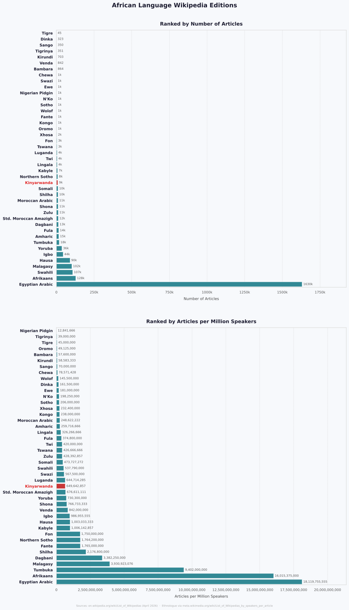

# kinya-wikipedia

**Kinyarwanda Wikipedia Analysis**

## Objective

Analyse the Kinyarwanda Wikipedia (`rw.wikipedia.org`). 

The goal is to understand the
corpus — its size, coverage, and article distribution and size 

We use categorise articles using structured data from Wikidata. Wikidata's **P31 (instance of)** property is used to assign
each article a semantic category (e.g. person, place, organisation). 

This enables a systematic analysis of what topics the Kinyarwanda Wikipedia covers and where the gaps are.


## analysis overview 





For further results see [output/analysis/analysis_results.md](output/analysis/analysis_results.md).


---

## Pipeline Overview

```
Wikipedia dump (.xml.bz2)
        │
        ▼
01_wikipedia_process   ← download & extract articles  →  output/wikipedia/
        │
        ▼  article titles + IDs
02_wikidata_process    ← map articles to Wikidata Q-IDs
                       ← extract P31 (instance of) & other properties
                       ← convert full dump to triplet table  →  output/wikidata/
        │
        ▼  enriched article data
03_analysis            ← statistics, distributions, category breakdown  →  output/analysis/
```

---

## Folder Structure

```
30_WikipediaLLM/
├── 01_wikipedia_process/               # Step 1 – download & extract Wikipedia articles
│   ├── 01_NVIDIANemo_setup.sh          # NeMo / Docker / NVIDIA setup guide
│   ├── 02_wikipedia_run_full.sh        # Docker wrapper to run the download pipeline
│   ├── download_simplewiki.py          # Download & extract Wikipedia using NeMo Curator
│   └── nemo_wikipedia_notebook.ipynb
│
├── 02_wikidata_process/        # Step 2 – link articles to Wikidata & extract properties
│   ├── extract_article_wikidata_ids.py  # Query MediaWiki API for Wikidata Q-IDs
│   ├── wikidata_extract_p31.py          # Extract P31 (instance of) triplets from dump
│   ├── wikidata_extract_labels.py       # Resolve Q-IDs to human-readable labels
│   ├── wikidata_extract_items.py        # Fast extraction of specific Q-IDs from dump
│   ├── wikidata_to_triplets.py          # Convert full dump to Parquet triplet table
│   └── wikidata_query.py                # CLI tool to query the triplet table
│
├── 03_analysis/                # Step 3 – analysis and visualisations
│   └── wikipedia_analyze_rwikipedia.py  # Word/char distributions, top articles, plots
│
├── data/                       # Raw compressed Wikipedia & Wikidata dumps
│   ├── rwwiki-*-pages-articles-multistream.xml.bz2
│   └── ... any other wikipedia you download (e.g. for comparative purposes) 
│
└── output/                     # All generated outputs
    ├── wikipedia/              # Extracted articles and article–Wikidata ID mappings
    │   ├── rw_0.jsonl                      # Extracted Kinyarwanda articles
    │   ├── rw_article_wikidata_ids.tsv     # Article titles → Wikidata Q-IDs
    │   └── ...
    ├── wikidata/               # Wikidata property extractions and triplet tables
    │   ├── rw_p31_instances.tsv            # P31 triplets for Kinyarwanda articles
    │   ├── wikidata_triplets_test/         # Sample Parquet triplet table
    │   └── ...
    └── analysis/               # Plots (PNG) and summary tables (CSV)
        ├── 01_word_count_distribution.png
        ├── 07_summary_stats.csv
        └── ...
```

---

## Step-by-Step Usage

### Step 1 — Download and extract Wikipedia

Set up the NeMo Curator environment (see `01_wikipedia_process/setup.sh`), then run:

```bash
# Download and extract Kinyarwanda Wikipedia
bash 01_wikipedia_process/run_full.sh --language rw
```

Output: `output/wikipedia/rw_0.jsonl` — one JSON object per article.

### Step 2 — Link articles to Wikidata

```bash
# 2a. Query the MediaWiki API to get a Wikidata Q-ID for each article
python 02_wikidata_process/extract_article_wikidata_ids.py \
    --input  output/wikipedia/rw_0.jsonl \
    --out    output/wikipedia/rw_article_wikidata_ids.tsv \
    --api    https://rw.wikipedia.org/w/api.php

# 2b. Extract P31 (instance of) triplets from the Wikidata dump
python 02_wikidata_process/wikidata_extract_p31.py \
    --input  output/wikipedia/rw_article_wikidata_ids.tsv \
    --dump   data/wikidata-all.json.bz2 \
    --out    output/wikidata/rw_p31_instances.tsv

# 2c. Resolve Q-IDs to English labels
python 02_wikidata_process/wikidata_extract_labels.py \
    --input  output/wikidata/rw_p31_instances.tsv \
    --dump   data/wikidata-all.json.bz2

# Optional: convert the full Wikidata dump to a queryable Parquet triplet table
python 02_wikidata_process/wikidata_to_triplets.py \
    --dump data/wikidata-all.json.bz2 \
    --out  output/wikidata/
```

### Step 3 — Analyse

```bash
python 03_analysis/wikipedia_analyze_rwikipedia.py
```

Outputs plots and CSV summaries to `output/analysis/`.

---

## Key Concepts

| Term | Meaning |
|------|---------|
| **Q-ID** | Wikidata identifier for an entity (e.g. `Q642` = Rwanda) |
| **P31 (instance of)** | Wikidata property linking an entity to its type (e.g. person, city) |
| **Triplet** | A `(subject, property, object)` fact, the basic unit of Wikidata |
| **NeMo Curator** | NVIDIA framework used to download and extract Wikipedia articles |
