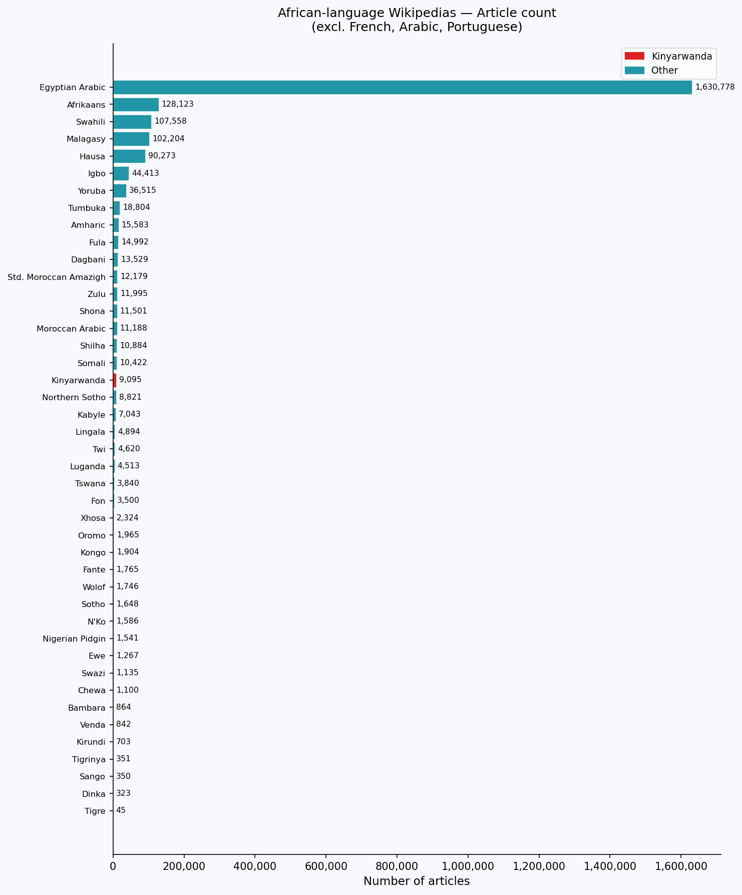
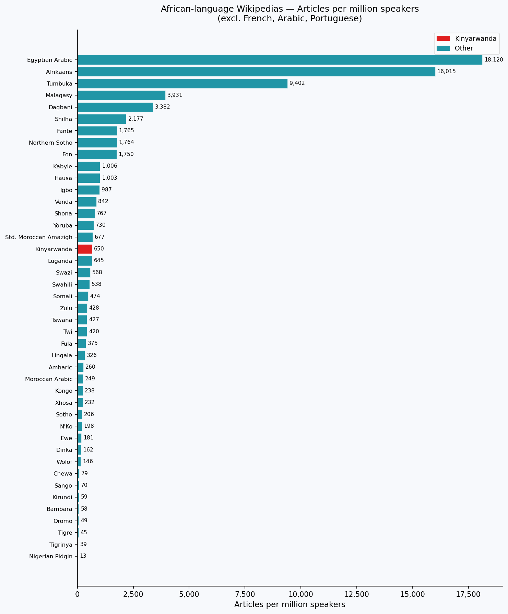
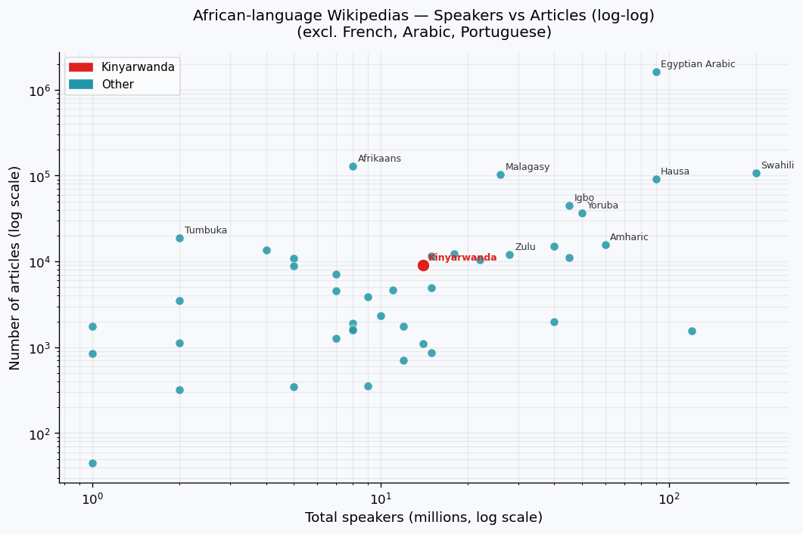
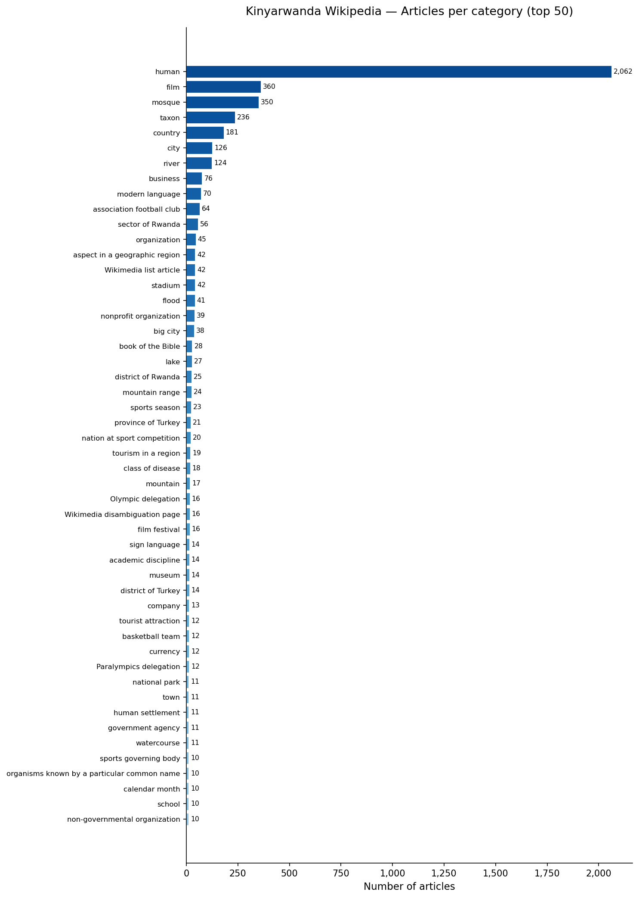
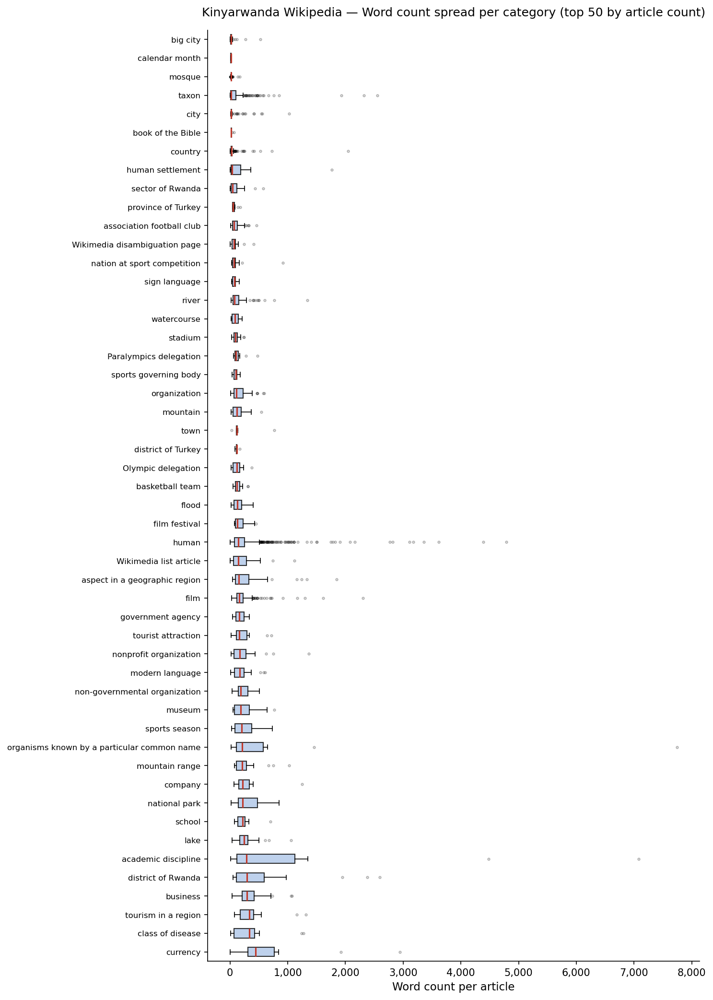

# Analysis Results — Kinyarwanda Wikipedia

## Summary Statistics

| Metric | Value |
|--------|-------|
| Total articles | 11,945 |
| Total words | 2,352,103 |
| Mean words / article | 197 |
| Median words / article | 118 |
| Std deviation | 387 |
| Min | 0 |
| Max | 14,627 |
| P10 | 20 |
| P25 | 54 |
| P75 | 228 |
| P90 | 391 |
| P95 | 542 |
| P99 | 1,316 |
| Articles with 0 words | 30 |

## Key Findings

- The Kinyarwanda Wikipedia contains **11,945 articles** totalling **2.35 million words**.
- The distribution is heavily right-skewed: the **median article has only 118 words**, well below the mean of 197 words.
- **50% of articles have 118 words or fewer** — roughly the length of a short paragraph.
- **25% of articles have 54 words or fewer** (P25), indicating a large share of stub-level content.
- **10% of articles have 20 words or fewer** (P10), essentially empty or near-empty stubs.
- **90% of articles have fewer than 391 words** (P90), and 95% fewer than 542 words (P95).
- Only the top 1% of articles exceed **1,316 words** (P99), with the longest article reaching 14,627 words.
- **30 articles (0.25%)** contain zero words and likely represent redirect or placeholder pages.

---

## Comparison with Other African-Language Wikipedias

*Dataset: 43 African-language Wikipedias (excl. French, Arabic, Portuguese as colonial/global languages). Source: `wikipedia_languages_dataset.xlsx`, April 2026.*

### Charts

**Article count — all African-language Wikipedias**

**Articles per million speakers — all African-language Wikipedias**

**Speakers vs Articles (log-log scatter)**

---

### Kinyarwanda at a glance

| Metric | Kinyarwanda | Rank among 43 African wikis |
|---|---:|---:|
| Articles | 9,095 | 18 / 43 |
| Speakers (M) | 14 | — |
| Articles per million speakers | 650 | 17 / 43 |

### Top 5 by article count

| Language | Articles |
|---|---:|
| Egyptian Arabic | 1,630,778 |
| Afrikaans | 128,123 |
| Swahili | 107,558 |
| Malagasy | 102,204 |
| Hausa | 90,273 |
| … | … |
| **Kinyarwanda** | **9,095** |

### Top 5 by articles per million speakers

| Language | Art / M speakers |
|---|---:|
| Egyptian Arabic | 18,120 |
| Afrikaans | 16,015 |
| Tumbuka | 9,402 |
| Malagasy | 3,931 |
| Dagbani | 3,382 |
| … | … |
| **Kinyarwanda** | **650** |

### Key findings — comparative

- Kinyarwanda ranks **18th out of 43** African-language Wikipedias by article count, placing it solidly in the upper half but far behind the leaders (Egyptian Arabic at 1.6M, Afrikaans at 128K, Swahili at 108K).
- When normalised by speaker population, Kinyarwanda ranks **17th** with ~650 articles per million speakers — similar to its raw-count rank, indicating no particular over- or under-representation relative to its speaker base.
- The top performers by the articles-per-speaker ratio are **Egyptian Arabic**, **Afrikaans**, and **Tumbuka** — the last being a much smaller language (2M speakers) with a disproportionately large Wikipedia driven by a small dedicated editorial community.
- Some of languages with a larger speaker base than Kinyarwanda but fewer articles include **Oromo** (40M speakers, 1,965 articles), **Wolof** (12M, 1,746).
- The scatter plot shows that most African-language Wikipedias cluster in the lower-left (small speaker base, few articles), with Kinyarwanda sitting near the median along both axes.
- **Growth potential**: Kinyarwanda has a relatively strong institutional base (official language of Rwanda, a tech-forward country) and sits above many comparable languages, but the gap to Swahili (107K articles, 200M speakers) and Hausa (90K articles, 90M speakers) indicates significant room for community-driven expansion.

---

## Category Analysis

*Based on 5,520 articles that have a Wikidata type (xobject) label — the remaining ~6,400 articles have no category mapping.*

### Charts

**Articles per category (top 50)**

**Word count spread per category (top 50, ordered by median)**

---

### Coverage by category — top 20 (sorted by article count)

| Category | Articles | Median words | Mean words | Total words |
|---|---:|---:|---:|---:|
| human | 2,062 | 144 | 199 | 411,254 |
| film | 360 | 162 | 202 | 72,622 |
| mosque | 350 | 18 | 20 | 6,877 |
| taxon | 236 | 20 | 118 | 27,931 |
| country | 181 | 26 | 57 | 10,353 |
| city | 126 | 21 | 53 | 6,719 |
| river | 124 | 78 | 134 | 16,653 |
| business | 76 | 295 | 340 | 25,849 |
| modern language | 70 | 169 | 180 | 12,581 |
| association football club | 64 | 66 | 102 | 6,501 |
| sector of Rwanda | 56 | 45 | 91 | 5,082 |
| organization | 45 | 108 | 168 | 7,543 |
| aspect in a geographic region | 42 | 154 | 311 | 13,068 |
| Wikimedia list article | 42 | 145 | 211 | 8,871 |
| stadium | 42 | 92 | 100 | 4,208 |
| flood | 41 | 126 | 145 | 5,927 |
| nonprofit organization | 39 | 165 | 228 | 8,879 |
| big city | 38 | 16 | 42 | 1,601 |
| book of the Bible | 28 | 21 | 23 | 638 |
| lake | 27 | 242 | 285 | 7,691 |

### Best-covered categories by content depth (median words, min. 10 articles)

| Category | Articles | Median words | Note |
|---|---:|---:|---|
| business | 76 | 295 | Consistently substantial |
| lake | 27 | 242 | Well developed |
| district of Rwanda | 25 | 290 | Local geography well covered |
| modern language | 70 | 169 | Good depth |
| film | 360 | 162 | Large & reasonably detailed |
| nonprofit organization | 39 | 165 | Solid coverage |

### Thinnest categories (stub-level, median words < 25, min. 10 articles)

| Category | Articles | Median words | Note |
|---|---:|---:|---|
| mosque | 350 | 18 | Near-empty stubs |
| big city | 38 | 16 | Mostly placeholders |
| taxon | 236 | 20 | High article count, very thin |
| country | 181 | 26 | Wide coverage, shallow depth |
| city | 126 | 21 | Wide coverage, shallow depth |

### Key findings — categories

- **human** articles are by far the most numerous (2,062 = 37% of categorised articles), but content quality is mixed: median 144 words, and the spread is wide (std 280 words).
- **mosque** (350 articles) and **taxon** (236 articles) are quantitatively large categories but almost entirely stub-level content (median 18 and 20 words respectively).
- **business**, **lake**, and **district of Rwanda** articles have the best content depth among categories with at least 10 articles.
- **film** (360 articles, median 162 words) stands out as a large category with reasonable coverage.
- **academic discipline**, **concept**, and **sport in a geographic region** contain a handful of very long articles but high variance — a few detailed articles inflate the mean while most are thin.
- Rwanda-specific categories (**sector of Rwanda**, **district of Rwanda**, **province of Rwanda**, **Memorial of the Genocide against the Tutsi in Rwanda**) show relatively good depth, suggesting stronger local editorial effort.
